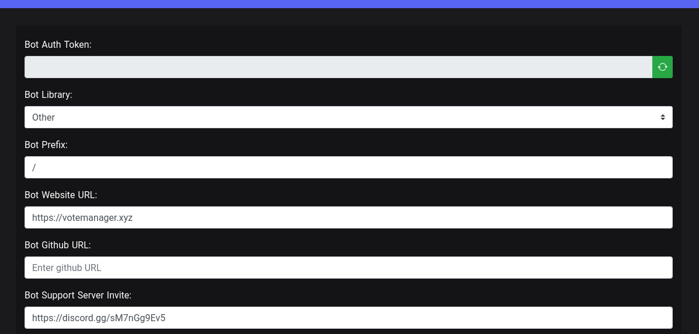
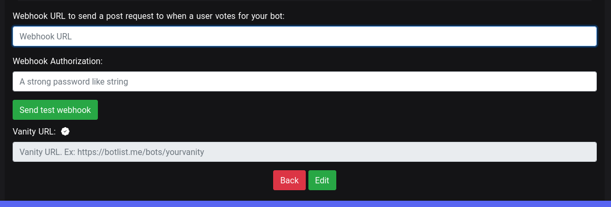
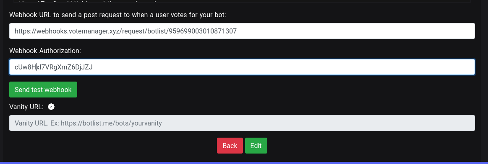
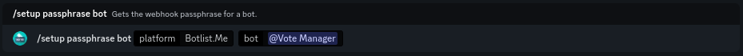

# Botlist.me


This continues from the tutorial on the previous page ([here](./))


To continue your setup, please go to the link shown as step one. It should look like this: `https://botlist.me/bot/[your-bots-id]/edit`

**E.G.** `https://botlist.me/bot/959699003010871307/edit`

<figure><figcaption>
Your bots Botlist.me settings page
</figcaption></figure>

You should be taken to a page that looks like the above image. Scroll down find the fields labelled **Webhook URL** and **Webhook Authorization** near the bottom.

<figure><figcaption>
Scroll down to the webhook options
</figcaption></figure>

&#x20;Please paste the URL provided in step two into the **Webhook URL** box. The URL should follow the format `https://webhooks.votemanager.xyz/request/botlist/[your-bots-id]/`

**E.G.** `https://webhooks.votemanager.xyz/request/botlist/959699003010871307/`

Next, enter the provided passphrase into the **Webhook Authorization** field

Once you have filled out the required fields, click the **Edit** button to save your changes

<figure><figcaption>
Webhook URL &#x26; Authorization have been filled out
</figcaption></figure>

If you forget or lose your passphrase, you can run the `/setup passphrase bot` command

<figure><figcaption>
Setup Passphrase Command
</figcaption></figure>

Your vote tracker is now fully setup! A message will be sent with your configured embed to the channel you configured whenever a user upvotes your bot
