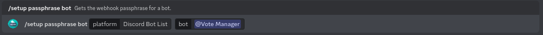

# Discord Bot List


This continues from the tutorial on the previous page ([here](./))


To continue your setup, please go to the link shown as step one. It should look like this: `https://discordbotlist.com/bots/[your-bots-id]/edit`

**E.G.** `https://discordbotlist.com/bots/959699003010871307/edit`

<figure><figcaption>
Your bots Top.gg webhooks page
</figcaption></figure>

You should be taken to a page that looks like the above image. Please paste the URL provided in step two into the **Webhook URL** box. The URL should follow the format `https://webhooks.votemanager.xyz/request/dbl/[your-bots-id]/`

**E.G.** `https://webhooks.votemanager.xyz/request/dbl/959699003010871307/`

You should then paste the passphrase shown in step six into the **Authorization** box. It should be a string of 20 random letters and numbers

<figure><figcaption>
Webhook URL &#x26; Authorization have been filled out
</figcaption></figure>

If you forget or lose your passphrase, you can run the `/setup passphrase bot` command

<figure><figcaption>
Setup Passphrase Command
</figcaption></figure>

Your vote tracker is now fully setup! A message will be sent with your configured embed to the channel you configured whenever a user upvotes your bot
