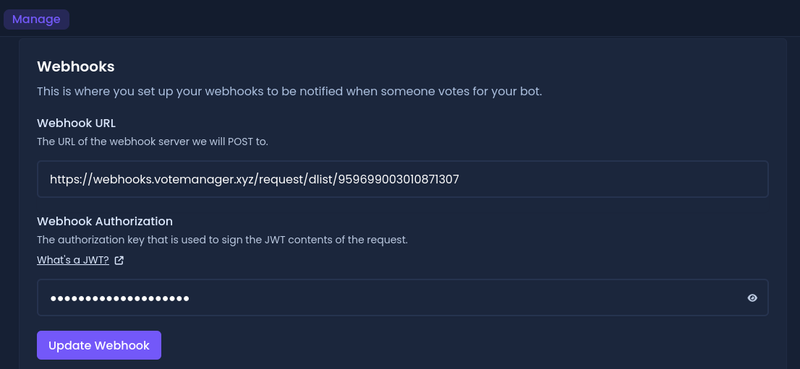

# Discord List


This continues from the tutorial on the previous page ([here](./))


To continue your setup, please go to the link shown as step one. It should look like this: `https://discordlist.gg/bot/[your-bots-id]/manage/webhooks`

**E.G.** `https://discordlist.gg/bot/959699003010871307/manage/webhooks`

<figure><figcaption>
Your bots Discord List webhooks page
</figcaption></figure>

You should be taken to a page that looks like the above image. Scroll down to the **Webhooks** section and enter the URL provided in step two of the setup message into the box labelled **Webhook URL** . The URL should follow the format `https://webhooks.votemanager.xyz/request/dlist/[your-bots-id]/`

**E.G.** `https://webhooks.votemanager.xyz/request/dlist/959699003010871307/`

Then, fill in the **Webhook Authentication** field with the passphrase provided in the setup message

<figure><figcaption>
Webhook URL &#x26; Authorization have been filled out
</figcaption></figure>

If you forget or lose your passphrase you can run the `/trackers passphrase` command. Select **Bot** for the type then choose the tracker from the options and run the command

<figure><figcaption>
Trackers Passphrase Command
</figcaption></figure>

Your vote tracker is now fully setup! A message will be sent with your configured embed to the channel you configured whenever a user upvotes your bot
