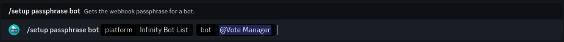

# Infinity Bots


This continues from the tutorial on the previous page ([here](./))


To continue your setup, please go to the link shown as step one. It should look like this: `https://infinitybots.gg/bot/[your-bots-id]/settings`

**E.G.** `https://infinitybots.gg/bot/959699003010871307/settings`

<figure><figcaption>
Your bots Infinity Bots settings page
</figcaption></figure>

You should be taken to a page that looks like the above image. Click on the sidebar option labelled **Webhooks** to view your bots webhooks

Next, click on the **+New Webhook** button show in the image below

<figure><figcaption>
Go to the Webhooks section
</figcaption></figure>

After doing so, you should see a button labelled **Untitled Webhook** appear underneath it. Clicking on it should expand to show the webhook details

<figure><figcaption></figcaption></figure>

Name the webhook something that shows what it is, for example, Vote Manager. Then, paste the URL provided in step two into the **Webhook URL** box. The URL should follow the format `https://webhooks.votemanager.xyz/request/ibl/[your-bots-id]/`

**E.G.** `https://webhooks.votemanager.xyz/request/ibl/959699003010871307/`

Enter the provided Passphrase into the **Webhook Secret** field. Ensure that **Simple Auth** is left unchecked and the **Event Whitelist** contains **NEW\_VOTE** or is left empty

<figure><figcaption>
Webhook URL &#x26; Authorization have been filled out
</figcaption></figure>

If you forget or lose your passphrase, you can run the `/setup passphrase bot` command

<figure><figcaption>
Setup Passphrase Command
</figcaption></figure>

Your vote tracker is now fully setup! A message will be sent with your configured embed to the channel you configured whenever a user upvotes your bot
