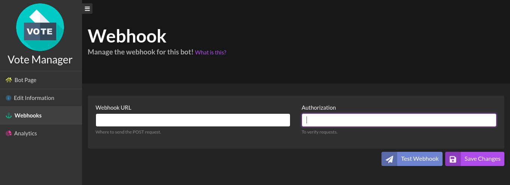
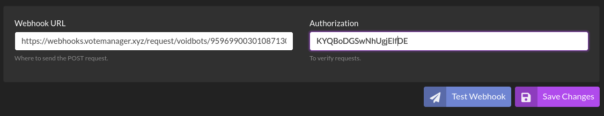
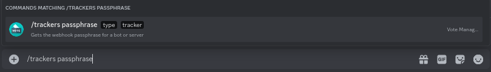

# Rovel Stars


This continues from the tutorial on the previous page ([here](./))


To continue your setup, please go to the link shown as step one. It should look like this: `https://voidbots.net/bot/[your-bots-id]/webhooks`

**E.G.** `https://voidbots.net/bot/959699003010871307/webhooks`

<figure><figcaption>
Your bots Void Bots webhook settings page
</figcaption></figure>

&#x20;Please paste the URL provided in step two into the **Webhook URL** box. The URL should follow the format `https://webhooks.votemanager.xyz/request/voidbots/[your-bots-id]/`

**E.G.** `https://webhooks.votemanager.xyz/request/voidbots/959699003010871307/`

Next, enter the provided passphrase into the **Authorization** field

Once you have filled out the required fields, click the **Edit** button to save your changes

<figure><figcaption>
Webhook URL &#x26; Authorization have been filled out
</figcaption></figure>

If you forget or lose your passphrase you can run the `/trackers passphrase` command. Select **Bot** for the type then choose the tracker from the options and run the command

<figure><figcaption>
Trackers Passphrase Command
</figcaption></figure>

Your vote tracker is now fully setup! A message will be sent with your configured embed to the channel you configured whenever a user upvotes your bot
