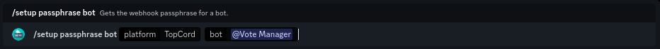

# TopCord


This continues from the tutorial on the previous page ([here](./))


To continue your setup, please go to the link shown as step one. It should look like this: `https://topcord.xyz/bot/[your-bots-id]/edit`

**E.G.** `https://topcord.xyz/bot/959699003010871307/edit`

You should be taken to your bots TopCord settings page. Enter the URL provided in step two of the setup message into the **Webhook URL** field. The URL should follow the format `https://webhooks.votemanager.xyz/request/topcord/[your-bots-id]/`

**E.G.** `https://webhooks.votemanager.xyz/request/topcord/959699003010871307/`

Next, paste the passphrase provided in step six of the setup message into the **Authorization** box. Finally, save your changes

If you forget or lose your passphrase, you can run the `/setup passphrase bot` command

<figure><figcaption>
Setup Passphrase Command
</figcaption></figure>

Your vote tracker is now fully setup! A message will be sent with your configured embed to the channel you configured whenever a user upvotes your bot
