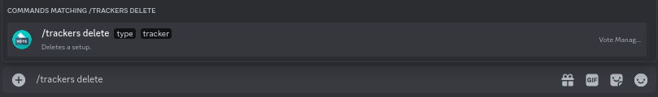
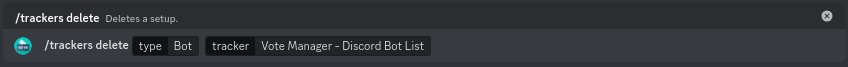

# Deleting


Deletion of your setup generally can't be undone and is final. See below for a list of things deleted when you delete your setup


Should you need to delete a vote tracker at any point, you can use the `/trackers delete` command. Simply fill in the required options and run the command

<figure><figcaption>
Trackers Delete command
</figcaption></figure>



* `type` - The type of tracker (select **Bot**)
* `tracker` - The tracker you wish to edit



<figure><figcaption>
Options have been filled out
</figcaption></figure>

Once you run the command, the setup for the provided bot on the provided platform will be deleted along with all cached votes. Please see below for more details on what gets deleted by the `/trackers delete` command and what to do if you accidentally delete your setup

**Please note that there is currently no conformation for setup deletion!**


We recommend also removing the webhook URL & Authentication from your bots page of the platform provided


#### Setup Deletion Includes

* Loss of vote tracking functionality on for the provided bot on the provided platform
* Loss of embed customisation, you will have to provide this information again if you chose to set up your bot with Vote Manager again
* Loss of all cached vote counts (for the vote leaderboard)

#### Setup Deletion Doesn't Include&#x20;

* Change or loss of your bots actual vote count of the provided platform
* Deletion of tracker on other platforms for your bot

#### Accidental Setup Deletion

If you got a bit too excited running commands, or you just selected the wrong option and your setup got deleted by mistake, you can contact us either by [email](mailto:contact@votemanager.xyz) or in our [discord server](https://votemanager.xyz/discord). If you can provide proof of ownership or an admin position and a recent vote leaderboard,  we can try to restore your bots cached vote counts and leaderboard. **We can't guarantee that we will be able to restore your data**
