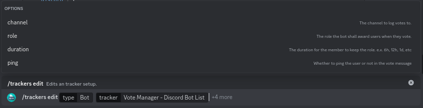

# Editing


This requires you to already have an existing setup for the bot on the platform you want to edit


To edit a vote tracker, simply run the `/trackers edit` command and fill in the required options.

<figure><figcaption>
Trackers Edit Command
</figcaption></figure>

Use the optional `channel`, `role` & `duration` parameters to change the respective settings for the vote tracker. Any options left blank will retain their previous value



* `type` - The type of tracker (select **Bot**)
* `tracker` - The tracker you wish to edit



* `channel` - Channel to send your vote message in
* `role` - Role to be given to users after they vote
* `duration` - How long user should keep the role specified above



<figure><figcaption>
Options have been filled out
</figcaption></figure>


Other rewards can be managed via the `/rewards` command (more details [here](broken-reference))


Once you have run the `/trackers edit` command, the vote message embed will appear, allowing your vote embed to be updated. If you wish to leave your vote embed the same, simply press <mark style="color:purple;">**Submit**</mark>

<figure><figcaption>
Vote Message Embed Builder
</figcaption></figure>


You can use variables to have vote information in your vote message. see [here](../variables.md) for more details




* **Title** - title of the embed
  * <mark style="color:green;">**✓**</mark> <mark style="color:green;"></mark><mark style="color:green;">- Variables are supported</mark>
  * <mark style="color:green;">**✓**</mark> <mark style="color:green;"></mark><mark style="color:green;">- Markdown is supported</mark>
* **Color** - color of the left border on the embed
  * <mark style="color:green;">**✓**</mark> <mark style="color:green;"></mark><mark style="color:green;">- Variables are supported</mark>
  * <mark style="color:red;">**✗**</mark> <mark style="color:red;"></mark><mark style="color:red;">- Markdown is not supported</mark>
  * <mark style="color:green;">**✓**</mark> <mark style="color:green;"></mark><mark style="color:green;">- Allowed formats</mark>
    * Hex code (Ex `#0bbbb7`)
    * Integer (Ex `0x0bbbb7`)
    * RGB color values (Ex `11, 187, 183`)
    * Preset (Ex `Red`)
* **Description** - main content of the embed
  * <mark style="color:green;">**✓**</mark> <mark style="color:green;"></mark><mark style="color:green;">- Variables are supported</mark>
  * <mark style="color:green;">**✓**</mark> <mark style="color:green;"></mark><mark style="color:green;">- Markdown is supported</mark>
* **Footer** - small text at the bottom of the embed
  * <mark style="color:green;">**✓**</mark> <mark style="color:green;"></mark><mark style="color:green;">- Variables are supported</mark>
  * <mark style="color:red;">**✗**</mark> <mark style="color:red;"></mark><mark style="color:red;">- Markdown is not supported</mark>



* **Image** - Big image in the embed. Appears below the description
  * <mark style="color:green;">**✓**</mark> <mark style="color:green;"></mark><mark style="color:green;">- Variables are supported</mark>
  * <mark style="color:red;">**✗**</mark> <mark style="color:red;"></mark><mark style="color:red;">- Markdown is not supported</mark>
  * <mark style="color:green;">**✓**</mark> <mark style="color:green;"></mark><mark style="color:green;">- Allowed formats</mark>
    * Any `https`or `http` link to an image file


