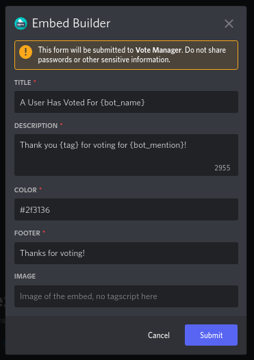

# Editing

If you made a small mistake in your setup or you just want to tweak the vote embed slightly, fear not! The `/setup edit` command is here to help


This requires you to already have an existing setup for the bot on the platform you want to edit


To edit a vote tracker, simply run the `/setup edit bot` command and fill in the required options.

Use the optional `channel`, `role` & `duration` parameters to change the respective settings for the vote tracker. Any options left blank will retain their previous value



* `platform` - The platform you want to edit the setup for
* `bot` - The bot you want to edit the setup for



* `channel` - Channel to send your vote message in
* `role` - Role to be given to users after they vote
* `duration` - How long user should keep the role specified above




Other rewards can be managed via the `/rewards` command (documentation can be found [here](broken-reference))


Once you have run the `/setup edit` command, the vote message embed will appear, allowing your vote embed to be updated. If you wish to leave your vote embed the same, simply press <mark style="color:purple;">**Submit**</mark>

<figure><figcaption>
Vote Message Embed Builder
</figcaption></figure>
