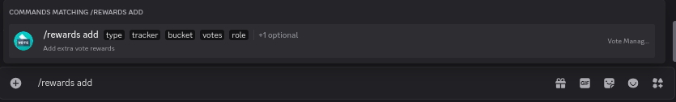
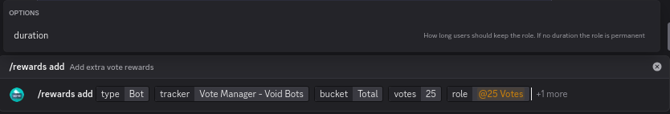

# Adding

To add a new role reward, run the `/rewards add` command

<figure><figcaption>
Rewards Add Command
</figcaption></figure>



* `type` - The type of tracker (**Bot**/**Server**)
* `tracker` - The tracker you wish to add a reward for
* `type` - The type of votes to check
* `votes` - How many votes the user needs to be given the role
* `role` - The role the user should be given



* `duration` - Set the duration the user should keep the role for



<figure><figcaption>
Options have been filled out
</figcaption></figure>

Once you have filled out all the options, you can run the command and the role reward will be saved

The role will now be given to any users to votes the provided number of times on the provided platform for the bot/server


The role is only given when a user reaches the number of votes. It will not be given to users who already have enough votes until they vote again

