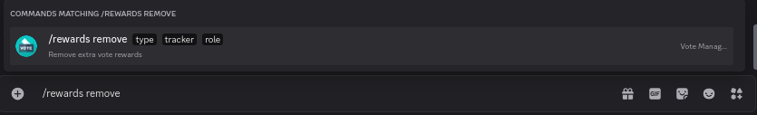
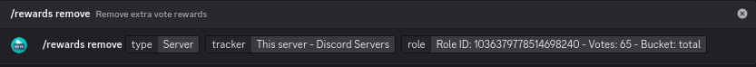
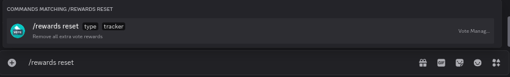
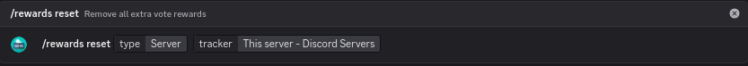

# Removing

## Removing a single reward

To remove a single role reward, run the `/rewards remove` command

<figure><figcaption>
Rewards Remove Command
</figcaption></figure>



* `type` - The type of tracker (**Bot**/**Server**)
* `tracker` - The tracker you wish to remove a reward from
* `role` - The reward that should be deleted



<figure><figcaption>
Options have been filled out
</figcaption></figure>

Once you have filled out all the options, you can run the command. The role reward will now not be given any more.


This does not remove the role from members, nor does it delete the role


## Removing All Rewards

Should you wish to remove all extra role rewards, you can use the `/rewards reset` command

<figure><figcaption>
Rewards Reset Command
</figcaption></figure>



* `type` - The type of tracker (**Bot**/**Server**)
* `tracker` - The tracker you wish to remove a reward from



<figure><figcaption>
Options have been filled out
</figcaption></figure>

Once you have filled out all the options you can run the command and all extra vote rewards will be removed


This does not remove any of the roles from members, nor does it delete any of the roles

