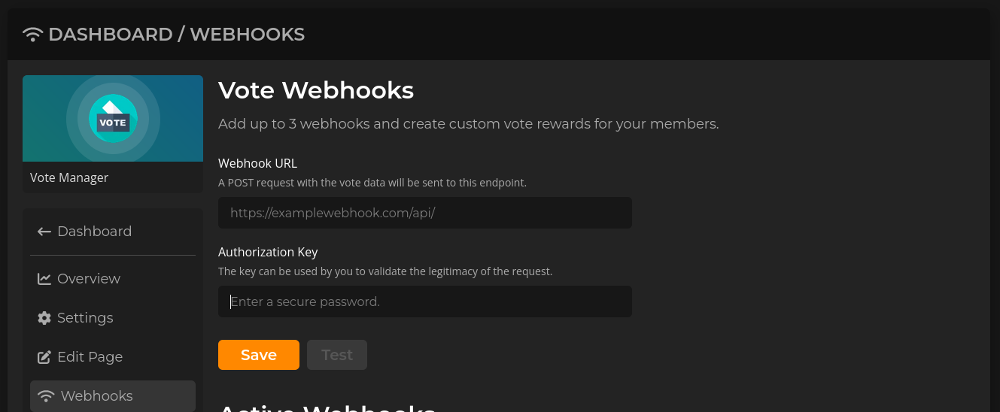
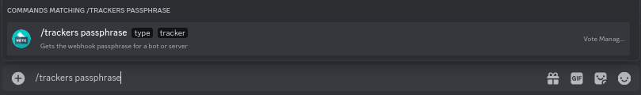

# Discadia


This continues from the tutorial on the previous page ([here](./))


To continue your setup, please go to the link shown as step one. It should look like this: `https://disurl.me/dashboard/server/[your-servers-id]/webhooks`

**E.G.** `https://disurl.me/dashboard/server/959775329843544074/webhooks`

<figure><figcaption>
Your servers Discord Servers webhooks page 
</figcaption></figure>

You should be taken to a page that looks like the above image.&#x20;

Paste the Webhook URL provided in step two into the field labelled **Webhook URL**. The URL should follow the format `https://webhooks.votemanager.xyz/request/disurl/[your-servers-id]/`

**E.G.** `https://webhooks.votemanager.xyz/request/disurl/959775329843544074/`

Next, enter the provided passphrase into the field labelled **Authorization Key**

<figure><figcaption>
Webhook Name &#x26; Payload URL have been filled out
</figcaption></figure>

After filling out the fields as described above, click on the **Save** button. You should see an item added in the Active Webhooks section

<figure><figcaption>
Webhook details have been saved
</figcaption></figure>

Your vote tracker is now fully setup! A message will be sent with your configured embed to the channel you configured whenever a user gives gems to/bumps your server

If you forget or lose your passphrase you can run the `/trackers passphrase` command. Select **Server** for the type then choose the tracker from the options and run the command

<figure><figcaption>
Trackers Passphrase Command
</figcaption></figure>
