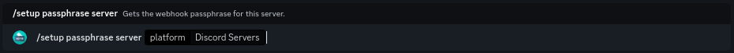

# Discord Servers


This continues from the tutorial on the previous page ([here](./))


To continue your setup, please go to the link shown as step one. It should look like this: `https://discordservers.com/pannel/[your-servers-id]/webhooks`

**E.G.** `https://discordservers.com/panel/959775329843544074/webhooks`

<figure><figcaption>
Your servers Discord Servers webhooks page 
</figcaption></figure>

You should be taken to a page that looks like the above image. Click on the **Add Webhook** in the bottom right

Name the webhook something that shows what it is, for example, Vote Manager. Then, paste the URL provided in step two into the **Payload URL** box. The URL should follow the format `https://webhooks.votemanager.xyz/request/discordservers/[your-servers-id]/`

**E.G.** `https://webhooks.votemanager.xyz/request/discordservers/959775329843544074/`


Discord Servers does not support Authentication with webhooks. You will not need to enter the provided passphrase anywhere


For the **Content Type** box, please leave it as the default value, `application/json`. Once you have filled out the options as shown below click on the **Submit** button

<figure><figcaption>
Webhook Name &#x26; Payload URL have been filled out
</figcaption></figure>

After clicking submit, you should have a table that looks similar to the image below:

<figure><figcaption>
The webhook details have been saved
</figcaption></figure>

Your vote tracker is now fully setup! A message will be sent with your configured embed to the channel you configured whenever a user gives gems to/bumps your server

If you forgot or lose your passphrase, you can view it using the `/setup passphrase server` command

<figure><figcaption>
The setup passphrase command
</figcaption></figure>
