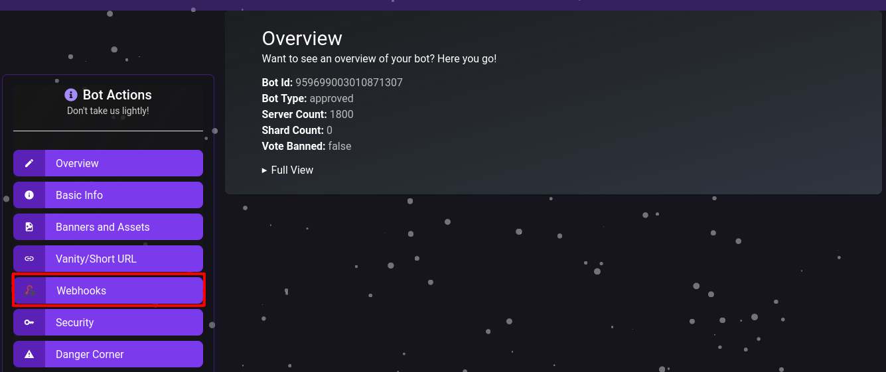
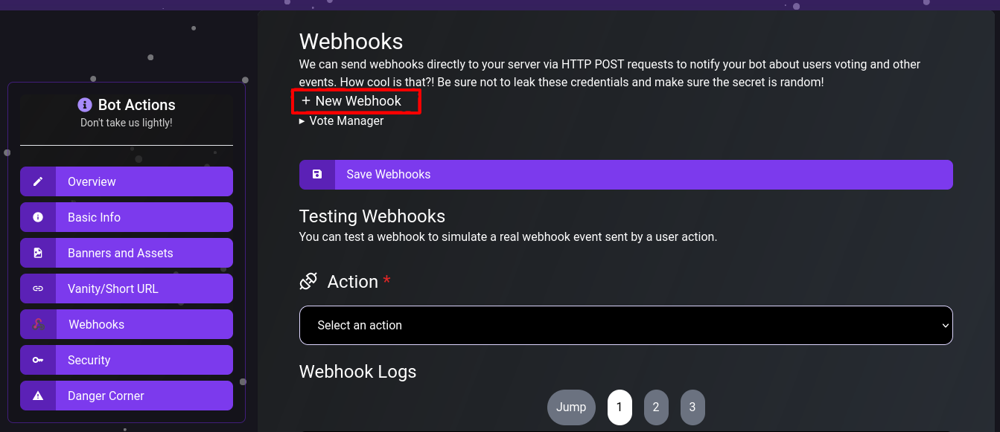
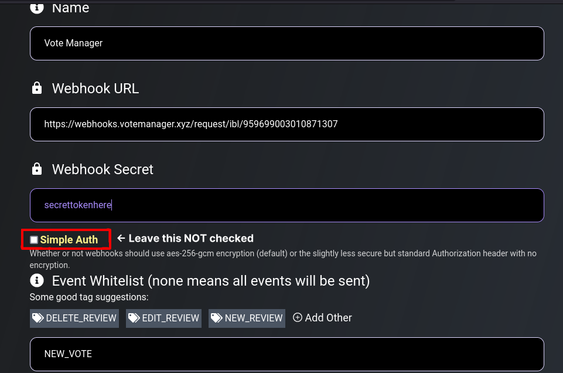
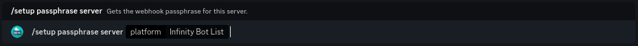

# Infinity Bots


This continues from the tutorial on the previous page ([here](./))



At the time of writing, server listing it not yet released on Infinity Bot List, but it currently in public beta


To continue your setup, please go to the link shown as step one. It should look like this: `https://infinitybots.gg/server/[your-servers-id]/settings`

**E.G.** `https://infinitybots.gg/server/877814636039266336/settings`

Then, click on **Webhooks** on the sidebar

<figure><figcaption>
Your servers IBL settings page 
</figcaption></figure>

You should be taken to a page that looks like the above image. Click on the **+ New Webhook** button to add a webhook.

<figure><figcaption>
Your servers webhook settings
</figcaption></figure>

Then click on the **> Untitled Webhook** button that will appear beneath it. It should expand, showing you options to configure the name, URL & authentication of the webhook

<figure><figcaption>
A webhook has been created
</figcaption></figure>

Name the webhook something that shows what it is, for example, Vote Manager. Then, paste the URL provided in step two into the **Webhook URL** box. The URL should follow the format `https://webhooks.votemanager.xyz/request/ibl/[your-servers-id]/`

**E.G.** `https://webhooks.votemanager.xyz/request/ibl/959775329843544074/`

Enter the provided Passphrase into the **Webhook Secret** field. Ensure that **Simple Auth** is left unchecked and the **Event Whitelist** contains **NEW\_VOTE** or is left empty

<figure><figcaption>
Webhook details have been filled out
</figcaption></figure>

Once you filled out the options described above, click on the **Save Webhooks** button

Your vote tracker is now fully setup! A message will be sent with your configured embed to the channel you configured whenever a user upvotes your server

If you forgot or lose your passphrase, you can view it using the `/setup passphrase server` command

<figure><figcaption>
The setup passphrase command
</figcaption></figure>
