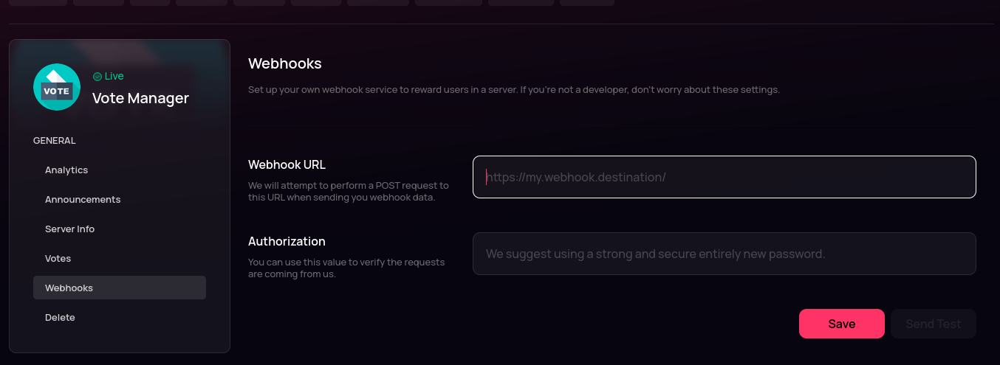
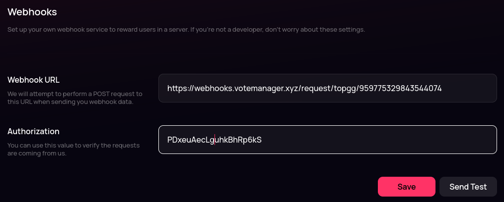

# Top.gg


Top.gg has how deprecated server listing. You can no longer create new trackers for servers on Top.gg and we recommend you delete existing ones&#x20;



This continues from the tutorial on the previous page ([here](../../bots/create/))


To continue your setup, please go to the link shown as step one. It should look like this: `https://top.gg/servers/[your-servers-id]/webhooks`

**E.G.** `https://top.gg/servers/959699003010871307/webhooks`

<figure><figcaption>
Your servers Top.gg webhooks page
</figcaption></figure>


You need to be logged in & own or be in a team that owns the server on Top.gg to access this page


You should be taken to a page that looks like the above image. Please paste the URL provided in step two into the **Webhook URL** box. The URL should follow the format `https://webhooks.votemanager.xyz/request/topgg/[your-servers-id]/`

**E.G.** `https://webhooks.votemanager.xyz/request/topgg/959775329843544074/`

You should then paste the passphrase shown in step six into the **Authorization** box. It should be a 20 character long string

<figure><figcaption>
Webhook URL &#x26; Authorization have been filled out
</figcaption></figure>

After entering the required details, click **Save**. Your vote tracker is now fully setup! A message will be sent with your configured embed to the channel you configured whenever a user votes for your server on Top.gg

If you forgot or lose your passphrase, you can view it using the `/setup passphrase server` command

<figure><figcaption>
Setup Passphrase Command
</figcaption></figure>
