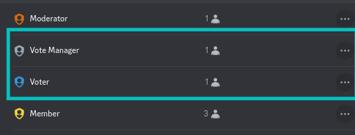

# Troubleshooting

The vote message is not being sent

Please ensure that the channel you have configured exists and that vote manager has the following permissions in it

* View Channel
* Send Messages
* Embed Links

The reward role is not being given

There are 2 common causes for this issue:

1. **Vote Manager does not have permission to give roles**\
   In order to solve this, please ensure that vote manager has a least one role with either the **Manage Roles** or **Administrator** permission
2. **The role Vote Manager is trying to give is above its highest role**\
   Bots are only able to give roles that are below their highest role. To solve this, move at least one role (likely the `Vote Manager` role above the role you are trying to give, for example

